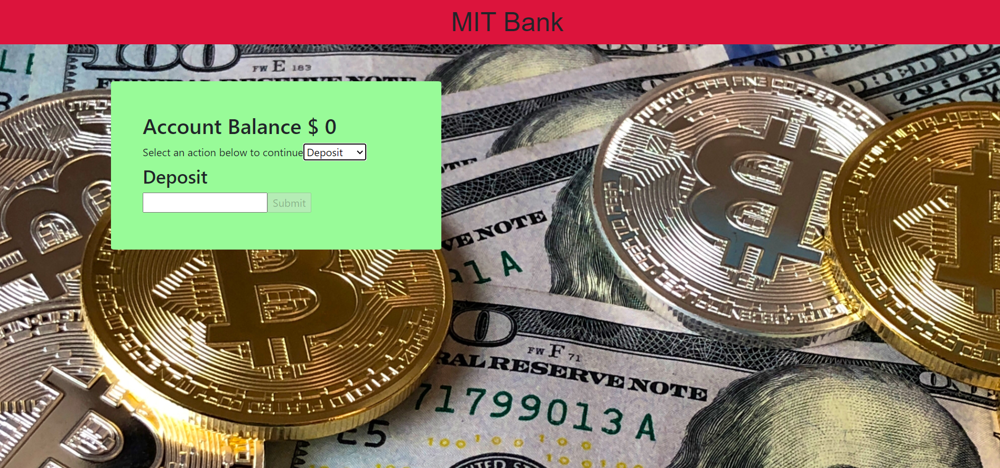
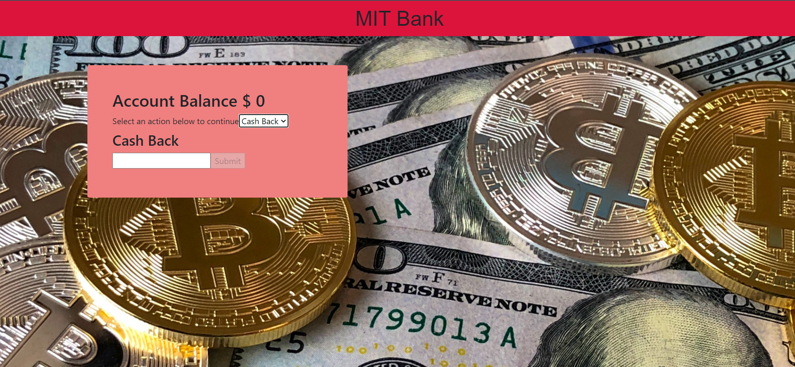

# ATM-Week15-
<div>


</div>

## Description:
  This is assignment from ***Professional Certificate in Coding: Full Stack Development with MERN*** Week15.</br>
  This program consists of jsx, html, css, image file.
  This program is the  banking site to track your deposit.

## Installation:
  1. Downloads each file into one file. <br>
    1. **index.html** <br>
    2. **atm.jsx** <br>
    3. **styles.css** <br>
    4. **pexels-david-mcbee-730547.jpg** <br>
  3. Open shell and type **npm install --global http-server**.
     ```console
     npm install --global http-server
     ```
  4. Type **npm install**.
     ```console
     npm install
     ```
  5. type **http-server -c-1** to start the server.
     ```console
     http-server -c-1
     ```
  6. Go online and type **localhost:8080** in URL box.

  
## Usage:
**[Live app](https://kojiroasano.github.io/ATM-Week15-/)**
  <p>If successfully installed and run on the Web browser, the banking site shows up. If you choose 'deposit' the background will be light green. If you choose 'cash back', the background turns red. (Generally, banks do not like users withdrawing lots of money.)</p>
  
## Support:
  If any question, message me via **[my twitter](https://twitter.com/Kojiro38895598)**.
  
## Roadmap:
  I might add priority, or due date.
  
## License information: 
 The most of the program is coded and contrubuted by MIT. If you use the part of this code in your program and show it to public, please include the name of ***MIT***.
 The image courtesy ***David McBee*** and retrieved from the [site](https://www.pexels.com/photo/bitcoins-and-u-s-dollar-bills-730547/).
